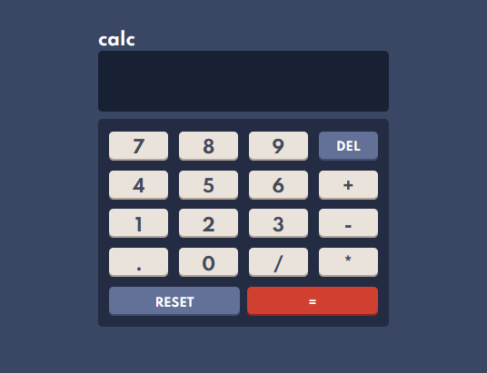

# Calculadora básica utilizando Vanilla JavaScript

### Projeto pessoal para prática de lógica de programação e design de interfaces.

### Tecnologias utilizadas.

* HTML
* Sass
* JavaScript

### Acesse a aplicação

https://cauegraciolip.github.io/calculadora/
